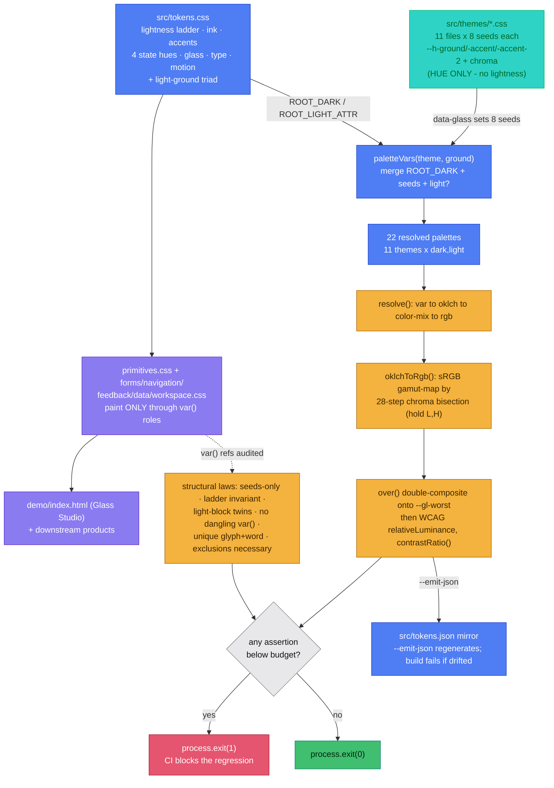

# glass — implementation & interview context

> Interview-ready context pack. Canonical repository: `D:\Code\glass`. Live deploy:
> **https://abheet19.github.io/glass/** (GitHub Pages, exact-SHA publish). Source and executable
> tests win if an older note disagrees. A dirty working tree is a candidate; a configured URL is not
> deployment proof. This file is fed to an external AI as briefing material — it is deliberately
> exhaustive, defines the trending terms, and carries likely interview questions with answers.

---

## 1. One-line pitch

Glass is a **framework-neutral CSS design system** whose central idea is that a theme owns *only* its
hue, and a script proves the whole palette is accessible before anything ships. It was **extracted**
from eight of my own projects that had independently converged on the same surface, and its
distinguishing feature is a **zero-dependency contrast compiler** that verifies WCAG 2.2 ratios
across 8 themes × 2 grounds = 16 palettes on every push.

## 2. The problem it solves

Cross-product **visual drift**. Weft (a CRDT editor) and Vantage (an analytics + MCP workspace) were
shipping byte-identical glass values, radii, motion curves and a three-way theme triad *without
sharing a single stylesheet*. Five smaller projects were saying the same three things — a dark
ground, a glass plane, one accent family — in a messier vocabulary (`--bg-elevated`,
`--glass-border`, a `--radius` with no scale, hex duplicated by hand into `tailwind.config.js` **and**
`theme.ts`). Glass unifies them onto one grammar **without** imposing a JavaScript framework or
runtime, so projects on plain CSS, Vite, Tailwind + MUI, and a browser extension can all share the
*tokens* and the *markup contract*.

## 3. Product contract

Semantic OKLCH tokens, eight product themes, reusable product/workspace CSS primitives, a Tailwind v3
adapter, a generated JSON mirror for non-CSS consumers, and executable quality/contrast/
interaction/accessibility/responsive contracts. CSS is the product; the demo's JavaScript only adds
example interactions.

---

## 4. Trending terms, defined (an interviewer may probe any of these)

- **OKLCH** — a perceptually-uniform colour space (`oklch(L C H)`: Lightness, Chroma, Hue). Unlike
  HSL/hex, a fixed `L` looks equally light at every hue, which is the *only* reason one shared
  lightness ladder can be worn by a crimson, a teal and an emerald and land in the same measured
  place. Glass authors colour in OKLCH and resolves it to sRGB itself.
- **Gamut mapping** — OKLCH describes more colours than sRGB can display. The most saturated in-gamut
  crimson carries `C 0.125` at `L 78%` but `C 0.195` at `L 50%`. The resolver clamps chroma to what
  sRGB actually holds (rather than letting the browser silently clip), which is why each accent ships
  **two** chroma values: a dark-ground one and a light-ground one.
- **WCAG 2.2** — the accessibility standard. Relevant success criteria here: **1.4.3** (text contrast
  4.5:1), **1.4.11** (non-text/graphic contrast 3:1), **1.4.6** (enhanced text 7:1, the AAA target),
  **2.5.8** (target size 24px), **1.4.12/1.4.13**, plus reduced-motion / reduced-transparency media
  queries. "AA" = the 4.5:1 tier; "AAA" = the 7:1 tier.
- **Contrast ratio** — computed from relative luminance: `(L_lighter + 0.05) / (L_darker + 0.05)`,
  range 1:1 → 21:1. The engine computes this from resolved sRGB, not from a library.
- **Design tokens** — named design decisions (`--accent`, `--r-2`, `--t-base`) used instead of raw
  values, so one edit re-skins everything and a JSON mirror can feed non-CSS consumers.
- **Semantic vs primitive tokens** — Glass exposes *semantic* roles (`--ink`, `--raised`, `--accent`)
  whose paint the component consumes; the raw seed numbers live only in theme files. Components never
  see a hex.
- **Glassmorphism / `backdrop-filter`** — frosted translucent panels (blur + tint + edge). Because
  translucency has no fixed luminance, its worst-case backdrop must be modelled to be tested — see
  `--gl-worst`.
- **`color-mix(in srgb, …)` & alpha compositing** — CSS colour interpolation and layering the engine
  reimplements so it can measure a translucent element against the plane behind it.
- **Three-way theme triad** — dark-first, with an explicit `light`/`dark` toggle that beats the OS
  and a `prefers-color-scheme` fallback that follows it. `color-scheme` is set in both directions so
  native controls follow.
- **CRDT / MCP** — context for the *consumers*, not glass itself: Weft is a CRDT (conflict-free
  replicated data type) collaborative editor; Vantage exposes analytics over the **MCP** (Model
  Context Protocol). Glass supplies both their surfaces.
- **`clamp()` type scale, `cubic-bezier` motion** — fluid typography and a shared easing
  (`cubic-bezier(.2,.8,.2,1)` over 120/220/400ms) that both flagships already used.

---

## 5. Architecture

```text
eight seed values per theme  +  shared semantic tokens (tokens.css)
  → CSS cascade + accessibility modes (reduced-transparency / motion, flat, forced fallbacks)
  → primitives / forms / navigation / feedback / data / workspace sheets (components.css)
  → Glass Studio (demo/index.html) + downstream products consume the SAME sheets
  → contrast.mjs: 814 contrast/structure assertions over 16 palettes  +  quality.mjs source hygiene
  → verify-demo.mjs: real-browser acceptance of every interactive flow
  → exact-SHA GitHub Pages release (release.json.sha == git HEAD)
```

The **contrast engine** (`scripts/contrast.mjs`) is the real engineering: a dependency-free colour
compiler that parses the stylesheets, resolves `var()` chains, evaluates `oklch()` with sRGB gamut
mapping, `color-mix(in srgb, …)` and alpha compositing, then asserts WCAG ratios against each token's
worst permitted backdrop across all 16 palettes and exits non-zero on drift. It also regenerates
`src/tokens.json` from the CSS and fails if the committed mirror has drifted.

`workspace.css` adds framework-neutral editor/agent/ops shell layout: title/status bars, project
trees, multi-file tabs, keyboard-resizable split panes, toggleable side panels, five tool tabs, a
command composer, sanitized run-details disclosure, filters, and metric cards. It owns *layout and
responsive state* only; the consuming product owns files, terminals, agents and execution.

## 6. Code map

| Path | Responsibility |
| --- | --- |
| `src/tokens.css`, `src/tokens.json`, `src/themes/*.css` | semantic roles, generated JSON mirror, eight seed-only theme files (8 numbers each) |
| `src/primitives.css`, `forms.css`, `navigation.css`, `feedback.css`, `data.css` | reusable controls and their states |
| `src/workspace.css` | responsive editor/agent/ops shell layout primitives |
| `src/components.css` | single import that pulls in all six component sheets |
| `tailwind-preset.js` | Tailwind v3 adapter mapping every colour to a `var()` (no `dark:` variants needed) |
| `scripts/contrast.mjs` | the contrast engine: colour math, budgets, seed/ladder/state/variable/JSON laws |
| `tools/quality.mjs`, `tools/verify-demo.mjs` | source hygiene and real-browser acceptance |
| `tools/capture-reel60.mjs` | Playwright + ffmpeg 60fps reel of the live redesigned flow → `docs/media/` |
| `tools/record-demo.mjs`, `tools/assemble_gif.py` | the older theme-switcher storyboard GIF |
| `demo/index.html` | **Glass Studio** — the app-shell demo (onboarding, sidebar, library, detail, settings, command palette) built from the same six sheets; both reference and dogfood |
| `.github/workflows` | CI + exact-SHA Pages assembly/deployment |

## 7. Invariants

- Component paint comes only from semantic roles; theme files cannot alter structure (a theme is
  eight numbers and nothing else — asserted).
- Tested text/focus/status/graphic combinations meet their declared WCAG 2.2 thresholds on both
  grounds.
- The resolved lightness ladder is numerically identical across all eight themes (spread 0.00).
- Colour is never the only state channel; every state carries a unique glyph and a unique word
  (asserted), plus native names/roles/states/keyboard behaviour.
- At 320px the page cannot overflow; wide data/tabs scroll only inside their intended containers.
- Every visible specimen action has a browser-tested observable result.
- `src/tokens.json` still matches the CSS it mirrors.
- Public completion requires `release.json.sha == git HEAD` after green CI and Pages.

---

## 8. The redesigned UI — Glass Studio (current)

`demo/index.html` is no longer a single scrolling page; it is an **app shell** built entirely from
the six real component sheets, so the demo is simultaneously the reference and the dogfood. The reel
in the README (`docs/media/glass-reel.mp4`, 60fps; `docs/media/glass-demo.gif`, looping teaser) drives
this exact flow against the live site:

1. **Onboarding hue-picker** (`#screen-onboarding`, `#obAccentGrid`) — the eight themes as wearable
   tiles; clicking one flips the live `data-glass` attribute and the whole app re-skins. Step 2 picks
   a ground (dark / system / light). Shown once, gated by a `localStorage` flag, resettable from the
   sidebar. `#obSkip` jumps straight into the Studio.
2. **Overview** — a hero plus four **live** stat tiles (pairs passing now, components documented,
   themes on shared tokens, active palette) read from the same `getComputedStyle` pipeline as the
   budget.
3. **Library → Components** (`#compGrid`) — a searchable, filterable grid of every real component,
   organised into groups; each card opens a **Detail** screen (`#screen-detail`) with Preview /
   Tokens / Code / Accessibility tabs, Tokens and Accessibility computed live at the current theme,
   ground and WCAG target.
4. **Library → Foundations / Patterns** — the ramp, the law (the same pairs `contrast.mjs` checks,
   recomputed in-browser), type & radii, the eight-theme gallery, and the responsive workspace shell.
5. **Per-project "what it uses"** (`#screen-project`, `#pjUsesGrid`) — pick a source project in the
   sidebar and the whole specimen set re-skins to that product's accent, showing the concrete glass
   parts each app actually consumes.
6. **Settings** — Appearance, Accessibility (the live **AA↔AAA** target toggle: AAA raises text to
   7:1; graphic pairs stay 3:1 because WCAG defines no stricter non-text tier), Projects, Install.
7. **Command palette** (`⌘K`/`Ctrl+K`) and **shortcuts overlay** (`?`) run the same code paths as the
   UI.

## 9. Current deploy

- **Live:** https://abheet19.github.io/glass/ — a root redirect to `./demo/`, with `src/` and
  `brand/` served side-by-side so the demo loads `../src/*.css` by the same relative paths it uses on
  disk. Nothing is bundled, minified or rewritten; the served file is the file you open locally.
- **Pipeline:** `.github/workflows/deploy-pages.yml` runs source quality + the full contrast budget +
  `npm run test:browser` *before* publishing, writes `{"sha": <GITHUB_SHA>}` to `/release.json`, and
  deploys. A palette that fails the law is never published.
- **Reel:** `tools/capture-reel60.mjs` captures the live site (fresh profile so onboarding shows) and
  motion-interpolates the recording to a true 60fps H.264 MP4 plus a looping GIF.

---

## 10. Likely interview questions & answers

**Q. Why OKLCH instead of hex/HSL?**
A. Perceptual uniformity. `L 78%` is the same apparent lightness at every hue, so one lightness ladder
can be shared across all eight accents and land in the same *measured* contrast position. HSL's
lightness is not perceptual, so a "50% lightness" teal and crimson would test wildly differently.

**Q. If you author in OKLCH, how do old browsers / canvas / email get colours?**
A. `contrast.mjs --emit-json` resolves every token to sRGB hex and writes `src/tokens.json`; the
`resolved.dark` / `resolved.light` maps are the fallback for consumers that can't evaluate `oklch()`.
The JSON is generated *from* the CSS and the build fails if it drifts, so it's derived data, never a
second source of truth.

**Q. Why does each accent carry two chroma values?**
A. Gamut. sRGB holds more chroma at mid lightness than at high lightness, so a single chroma would
either gamut-clip the dark accent or leave the light one duller than necessary. Each theme declares a
dark chroma and a light chroma, both capped at what sRGB can display.

**Q. What actually stops a theme from breaking accessibility?**
A. A theme file is *only* eight numbers — a ground hue/chroma and a hue-plus-two-chromas per accent.
Lightness, radii, type, motion and state hues live in `tokens.css` and are unreachable from a theme.
The script asserts each theme declares exactly those eight seeds and nothing else, and that the
resolved lightness ladder is identical across all eight. A theme can't break the ladder because it's
handed nothing to break it with.

**Q. How do you test contrast on glass, which is translucent?**
A. Glass has no fixed luminance, so `--gl-worst` — a never-painted *measurement* token — records the
worst realistic composite behind a pane, and text on glass is checked against that. The engine does
the alpha compositing itself. Note: every glass exclusion is a dark-ground exclusion, because on the
light ground the tint only lightens what's behind it, so glass there always beats the opaque plane.

**Q. Why write your own colour engine instead of using a library (culori, chroma.js, wcag-contrast)?**
A. Zero runtime *and* build dependencies was a hard requirement, and the engine has to understand the
*cascade* — resolve `var()` chains, `color-mix`, alpha, and each token's *permitted backdrop* — which
a generic contrast checker doesn't. It's ~one file, it runs in CI in well under a second on 16
palettes, and it doubles as the JSON generator.

**Q. What did writing the script actually catch?**
A. Three real bugs. (1) Vantage's light-mode `--warn` measured 3.59:1 as text — below AA. (2) Three
of the four state fills collapsed to within 0.0009 luminance of each other, so in greyscale or to a
deuteranope three statuses read as one — fixed by laddering their lightness while keeping hues. (3)
`--ink-2` missed the glass ceiling by 0.06 (4.44:1); lifted one lightness point to 4.60:1 rather than
shipping an exclusion no one would remember.

**Q. Isn't "extracted from eight projects" just marketing?**
A. No — it's the honest provenance and it's checkable. Weft and Vantage arrived at byte-identical
radii, motion and triad independently; `themes/weft.css` and `themes/vantage.css` document each
flagship's original value so the resolved delta is verifiable, not asserted. The remaining
differences (`--r-3` 18px vs 16px, `--gl-spec` alpha .32 vs .30) are exactly the drift two
independent implementations accumulate.

**Q. How is the demo not just a hand-made mock?**
A. Glass Studio imports the same six stylesheets a consumer does and re-runs the contrast maths in the
browser from `getComputedStyle`, so its stat tiles, ramp and budget table are measured live at
whatever theme/ground/WCAG target you pick. It's one more consumer of the package, not a separate
artifact — change a token and the Studio changes with it.

**Q. Is it on npm?**
A. No, deliberately. It's consumed via git clone, submodule, a `file:` workspace reference (Zeno), a
committed vendored copy via `tools/sync-glass.mjs` (Weft/Vantage, whose Docker build contexts can't
reach a sibling checkout), or jsDelivr's GitHub CDN. The `package.json` is correct and
side-effect-free but nothing is published.

**Q. Accessibility beyond contrast?**
A. Reduced-transparency and reduced-motion honoured (motion *off*, not shortened); a manual
`data-flat="1"` escape hatch; `--target-min: 24px` enforced inside `.btn`/`.field` (SC 2.5.8); a real
2px offset focus ring verified at 3:1 on every plane and on glass; native semantics for buttons/
labels/tabs/tabpanels/details; and browser tests that reject duplicate IDs, unnamed controls,
unlabelled fields and broken anchors. Colour is never the only channel.

**Q. How would you extend it — a ninth theme?**
A. Add `themes/<name>.css` with the eight seeds, register it in the demo's theme list, and run
`node scripts/contrast.mjs`. If any of the 16→18 palette ratios fail, the build stops and tells you
which pair, on which ground, by how much — you adjust chroma/ground seeds (never lightness) until it
passes, then `--emit-json` to refresh the mirror.

**Q. Known limits?**
A. Not on npm; CSS-only (no React/Web-Component bindings by design); integration is per-project;
`--gl-worst` is a model, not a measurement of *your* page (glass over a photo needs direct
measurement); one dark lightness ladder for all eight themes (faithful in hue, approximately faithful
in ground lightness, within 1.8 L points); Tailwind v3 preset only (v4 uses `@theme inline`); no
pixel-diff baseline suite (contrast + behaviour are machine-checked, visuals need human review).

---

## 11. Delivery and verification

Run `npm run validate` (format check + lint + contrast + browser) and `npm pack --dry-run`. CI runs
source quality, all 814 contrast/structure assertions across 16 palettes, and the browser groups.
Pages runs the same gates, publishes demo/source/brand, and writes the exact source SHA to
`/release.json`. This is automated WCAG-aligned evidence for the tested criteria — not an external
certification, a full screen-reader/device-fleet audit, or an npm publication. Validate each consumer
independently.

## 12. Reading order for a new agent

1. `CONTEXT.md` (this file) → 2. `README.md` → 3. `docs/USAGE.md` → 4. `src/tokens.css`, `src/themes/`
and the six component sheets → 5. `scripts/contrast.mjs`, `tools/verify-demo.mjs`, `demo/index.html`
→ 6. `docs/TESTING.md`, `docs/SANITY.md`.

Rules: use semantic roles; keep new interaction states native and testable; rerun quality/contrast/
browser/package gates after any source change; keep library/consumer/Pages/npm claims separate; do
not claim a release live until the exact public SHA is verified.

---

## 13. Annotated core code + knowledge graph

This section grounds every claim above in the actual source. It exists so an interview-assist AI can
answer "explain this code", "why is it written this way", and "what's the complexity/trade-off" for
the file on screen. Everything below quotes real file, function and token names; nothing is invented.

### 13.1 Knowledge graph / structure summary

One law runs the whole system: **a theme owns hue; `tokens.css` owns lightness (and everything else
structural).** A theme file is *only* eight numbers (`--h-*`, `--c-*`); the lightness ladder, type,
motion, glass geometry and the four state hues live once in `tokens.css`. `scripts/contrast.mjs` is a
dependency-free colour compiler that reads the stylesheets back, resolves every `var()`/`oklch()`/
`color-mix()` to sRGB, and asserts the WCAG budget across every discovered palette — failing CI on
drift. Palette and assertion counts are **derived from the files on disk**, not hard-coded: the
engine `readdirSync`s `src/themes/`, so today's 11 theme files give 11x2 = 22 palettes and
1111 assertions, and adding a ninth-through-Nth theme grows both automatically.



**One-line-per-file index (the files that matter):**

- `scripts/contrast.mjs` — the whole engine: sRGB/OKLab/OKLCH math, gamut mapping, CSS parser,
  `var()`/`color-mix()` resolver, the 14-column contrast budget, the structural laws, and the
  `tokens.json` mirror. Exits non-zero on any failure. **Read this first.**
- `src/tokens.css` — the token model: `:root` dark ground + the seed defaults, the fixed lightness
  ladder, ink/accent/state/glass tokens, and the light-ground triad written twice (section 2) plus
  the a11y fallbacks (section 3).
- `src/themes/*.css` — 11 seed-only files; each sets exactly the eight `SEED_PROPS` on
  `:root[data-glass="<name>"]` and nothing else (a structural law enforces "nothing else").
- `src/primitives.css` — the single `.glass` recipe plus `.card/.btn/.field/.chip/.state/.gauge`;
  introduces no raw colour/radius/duration/font — everything is a `var()`.
- `src/components.css` — barrel `@import` that pulls the six component sheets together.
- `src/forms.css`, `navigation.css`, `feedback.css`, `data.css`, `workspace.css` — component sheets;
  `workspace.css` owns editor/agent/ops **layout** state only.
- `src/tokens.json` — generated sRGB-hex mirror of every token for consumers that cannot evaluate
  `oklch()`; regenerated by `--emit-json`, verified on every plain run.
- `tailwind-preset.js` — Tailwind v3 adapter mapping each colour to a `var()` (no `dark:` variants).
- `tools/verify-demo.mjs`, `tools/quality.mjs` — real-browser acceptance and source hygiene.
- `demo/index.html` — Glass Studio; both the reference app and the dogfood surface.

### 13.2 Core excerpt A — the OKLCH token model (the seed/ladder split)

The reason one ladder can be shared by a crimson, a teal and an emerald: in `tokens.css` the
**lightness is a literal** and only **hue + chroma are `var()`s** a theme supplies. A theme therefore
has no lightness token in scope and *cannot* move the ladder. Verbatim from `src/tokens.css`
sections 1.1-1.2:

```css
  --h-ground: 359.8;  --c-ground: 0.0088;
  --h-accent: 22.2;   --c-accent: 0.125;    --c-accent-lt: 0.195;
  --h-accent-2: 32.5; --c-accent-2: 0.178;  --c-accent-2-lt: 0.163;
  /* ... */
  --bg:      oklch(14% var(--c-ground) var(--h-ground));
  --surface: oklch(19% var(--c-ground) var(--h-ground));
  --raised:  oklch(24% var(--c-ground) var(--h-ground));
  --line:    oklch(31% var(--c-ground) var(--h-ground));
```

And the merge that produces one palette, verbatim from `scripts/contrast.mjs` (`paletteVars`):

```js
function paletteVars(theme, ground) {
  const seeds = declsFor(themeCss[theme], `:root[data-glass="${theme}"]`) || {};
  const base = { ...ROOT_DARK, ...seeds };
  return ground === 'light' ? { ...base, ...ROOT_LIGHT_ATTR } : base;
}
```

**Line by line.** `--h-*`/`--c-*` are the eight `SEED_PROPS` — the only tokens a theme is allowed to
declare. `--c-accent-lt` is a *separate* light-ground chroma from `--c-accent` because sRGB is not a
cylinder: the most saturated in-gamut crimson at L 78% carries less chroma than at L 50%, so one
number per ground would either clip on dark or dull on light. The four `oklch(L% var(--c) var(--h))`
declarations fix `L` as a constant (14/19/24/31%) and defer only hue/chroma to the theme — that is
the entire mechanism behind "a theme owns hue, the system owns lightness". In `paletteVars`, `seeds`
spread *after* `ROOT_DARK` so a theme overrides the built-in default hue; for the light ground,
`ROOT_LIGHT_ATTR` spreads *last* so it overrides the derived dark values. Because seeds and derived
tokens are disjoint sets, the override order is safe.

**An interviewer might ask:** *"Why OKLCH instead of hex or HSL, and why split chroma per ground?"*
Answer: OKLCH is perceptually uniform — one `L` number means the same apparent lightness at every
hue, which is the *only* reason a single lightness ladder can be shared across all 11 themes and land
in the same place (HSL "lightness" is not perceptual; hex hard-codes all three channels so a theme
couldn't rotate hue without also moving contrast). Chroma is split per ground because sRGB's gamut
boundary depends on lightness, so the darkest in-gamut accent and the lightest one need different
chroma ceilings; one shared number would mean the browser silently clips one of them and you'd ship
a colour you never measured.

### 13.3 Core excerpt B — the contrast-budget check that fails the build

This is the real engineering. Two pieces: (1) `oklchToRgb` gamut-maps an out-of-range `oklch()` the
same way a browser does, so the script measures *what the user actually sees*; (2) the `R()` closure
inside `makeCheck` composites foreground and backdrop over a neutral grey and returns the WCAG ratio,
and any ratio below its minimum increments `failures`, which drives `process.exit(1)`. Verbatim from
`scripts/contrast.mjs`:

```js
function oklchToRgb(L, C, H) {
  let lin = oklchToLinearRgb(L, C, H);
  if (!inGamut(lin)) {
    let lo = 0, hi = C;
    for (let i = 0; i < 28; i++) {
      const mid = (lo + hi) / 2;
      if (inGamut(oklchToLinearRgb(L, mid, H))) lo = mid; else hi = mid;
    }
    lin = oklchToLinearRgb(L, lo, H);
  }
  return lin.map((c) => linearToSrgb(Math.min(1, Math.max(0, c))));
}
```

```js
  const R = (value, backdropValue) => {
    const bd = resolve(backdropValue, vars);
    const fg = resolve(value, vars);
    return contrastRatio(over(fg, over(bd, [128, 128, 128])), over(bd, [128, 128, 128]));
  };
```

**Line by line.** `oklchToLinearRgb` applies Bjorn Ottosson's OKLab-to-linear-sRGB matrices
unmodified. `inGamut` tests whether all three linear channels sit in `[0,1]` (with epsilon). If not,
the loop does **CSS Color 4 gamut mapping the cheap honest way**: hold `L` and `H`, binary-search the
chroma `C` down (`lo`/`hi` bisection, 28 iterations, about 2^-28 precision) until the colour is
representable, then clamp and convert to 8-bit sRGB — exactly what a browser does to an out-of-gamut
`oklch()`, so the measured number is the rendered number. In `R()`, `over()` is source-over alpha
compositing; the **double `over(...)`** is the key idea: a translucent backdrop (glass) is first
composited onto a neutral mid-grey `[128,128,128]` to give it a *defined* luminance, then the
(possibly translucent) foreground is composited onto that — because "text on glass" is otherwise
unmeasurable, glass having no fixed luminance of its own. `contrastRatio` is the standard
`(L1+0.05)/(L2+0.05)` on WCAG relative luminance. Every call is recorded; `record()` bumps `failures`
when `ratio < min`, and the verdict block runs `process.exit(failures === 0 ? 0 : 1)` so CI genuinely
blocks a regression.

**An interviewer might ask:** *"What's the complexity, and why bisection instead of a closed-form
gamut clip?"* Answer: each palette check is O(1) colour ops; the gamut map is a fixed 28-iteration
bisection (constant time, about 10^-8 chroma precision) rather than solving the sRGB gamut boundary
analytically — the boundary is a non-convex shape in OKLCH, so a closed form is fiddly and
browser-specific, whereas bisecting chroma while holding L and H is monotonic, dependency-free, and
provably matches the browser's own reduce-chroma behaviour. Total cost is 22 palettes times a few
dozen pairs each (about 1100 assertions), all pure arithmetic, so the whole suite runs in well under
a second with zero dependencies. *Follow-up: "Why measure over grey `[128,128,128]`?"* — it is the
neutral worst-case stand-in for "whatever is behind the glass", paired with the `--gl-worst` token
(section 13.4) that models the brightest realistic composite; measuring against a fixed reference
makes the ratio reproducible instead of dependent on live page content.

### 13.4 Core excerpt C — the single glass recipe and why it's measured against `--gl-worst`

There is exactly one glass material. `.glass` in `primitives.css` reads six tokens and adds nothing;
its worst-case legibility is pinned by `--gl-worst` in `tokens.css`, a token that is **never
painted** — it exists only so the budget can measure text on glass. Verbatim:

```css
.glass {
  background: var(--gl-fill);
  -webkit-backdrop-filter: var(--gl-blur);
  backdrop-filter: var(--gl-blur);
  border: 1px solid var(--gl-edge);
  border-radius: var(--r-3);
  box-shadow: var(--gl-shadow);
}
```

```css
  --gl-fill:   oklch(20% var(--c-ground) var(--h-ground) / .55);
  /* --gl-worst is NOT A PAINT COLOUR. Nothing is ever filled with it. */
  --gl-worst: color-mix(in srgb, oklch(100% 0 0) 8%, var(--line));
```

**Line by line.** `.glass` is a pure composition of tokens: `--gl-fill` (a roughly 55%-alpha tint
that takes the theme hue), `--gl-blur` (`blur(14px) saturate(1.4)` — a saturation lift so content
reads refracted, not smeared), `--gl-edge`/`--gl-spec` (the 1px object edge and the specular top
lip), `--r-3` (16px, the radius reserved for glass), and `--gl-shadow` (the inset spec + cast). It
introduces **no raw value** — the file's rule #1. `--gl-worst` models the single hardest case for
text-on-glass: pure white tint at the 8% strength the ambient ground can lift it to, `color-mix`ed
over `--line` (the lightest neutral a glass pane may sit above). Because glass has no fixed
luminance, the budget can only be honest if the worst realistic backdrop is written down — this is
that constant. It is a **dark-ground** concern by design: on the light ground the tint only ever
*lightens* what's behind it while every ink is dark, so glass there always has more contrast than the
opaque `--raised` plane and is never the binding case.

**An interviewer might ask:** *"How do you contrast-test a translucent, blurred surface at all,
isn't its colour whatever's behind it?"* Answer: exactly, which is why the system refuses to guess.
`--gl-worst` freezes the worst realistic composite into a token, and the engine composites text over
it (via the double `over()` in section 13.3); text roles that clear it (`--ink`, `--accent`, and
`--ink-2` after it was nudged one L-point to clear 4.5:1) are allowed on glass, while roles that fail
(`--ink-3` at about 2.39:1, `--accent-2` at about 3.69:1) are *forbidden* as text there — and the
script asserts those exclusions are **necessary** (the forbidden pair really does measure below
threshold), so a rule can't rot into folklore. The honest caveat: `--gl-worst` is a model, not a
measurement of *your* page — glass over a photograph still needs direct measurement.
