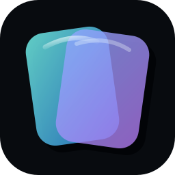
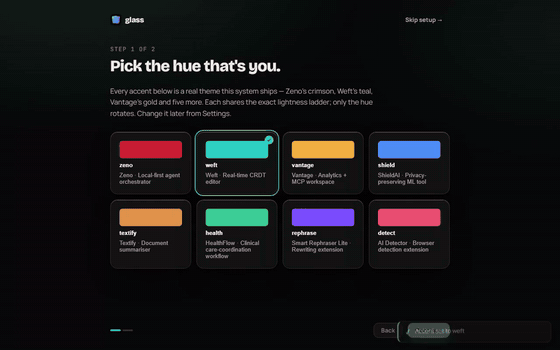
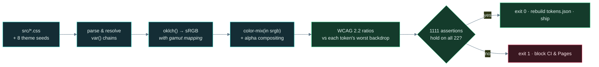
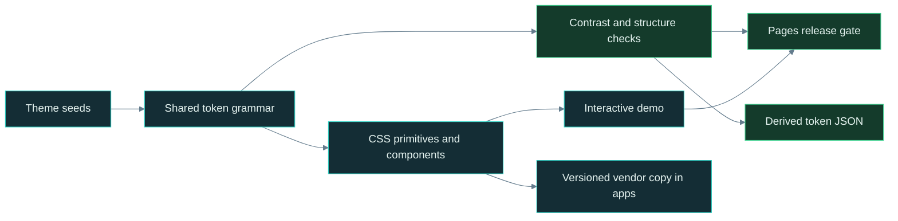
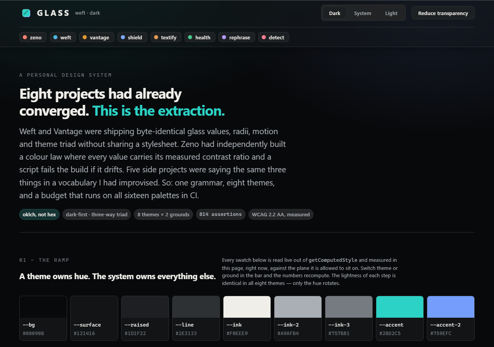
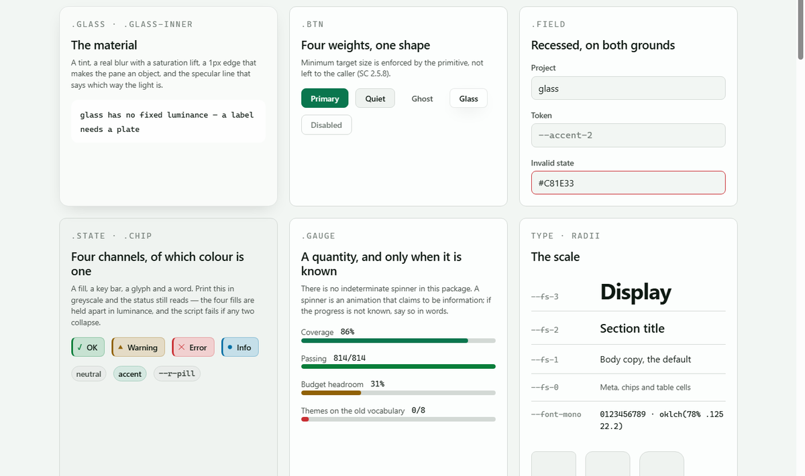

<div align="center">

<br>



# ◆ &nbsp;G L A S S

### **A theme owns hue. The system owns everything else.**

Eight of my projects converged on the same surface without ever sharing a stylesheet.<br>
This is the extraction — **one importable grammar**, eleven themes, and a contrast law<br>
that a script proves on every one of them.

<br>

[](https://github.com/abheet19/glass/actions/workflows/ci.yml)
[](https://abheet19.github.io/glass/demo/)
[](#-the-eleven-themes)
[](#-the-contrast-law)
[](#why-oklch-and-not-hex)
[](#-what-it-doesnt-do)
[](#-what-it-doesnt-do)
[](#-the-components)
[](#-project-integrations)
[](LICENSE)

<br>

<sub>A personal design system by <b><a href="https://github.com/abheet19">Abheet</a></b>. Extracted, not invented — every value here was already shipping in one of eight projects.<br><b>It is not published to npm.</b> Use it from a git clone or a submodule.</sub>

<br>

</div>

<div align="center">

<a href="https://abheet19.github.io/glass/"></a>

<sub><b>▶ <a href="docs/media/glass-reel.mp4">Watch the full 60fps reel</a></b> &nbsp;·&nbsp; <b><a href="https://abheet19.github.io/glass/">Open it live</a></b><br>Real capture of the <a href="https://abheet19.github.io/glass/">live site</a> — nothing staged. The onboarding <b>hue-picker</b> (each of the eleven themes worn live) → <b>Skip</b> → the <b>component gallery</b> scrolled through its groups → a <b>component detail</b> → a per-project <b>“what it uses”</b> view where every specimen re-skins to that product's accent. Recorded by <a href="tools/capture-reel60.mjs"><code>tools/capture-reel60.mjs</code></a> against <code>abheet19.github.io/glass</code>; see <a href="#-demo">Demo</a>.</sub>

<br>

</div>

> [!NOTE]
> **The contrast law is verified, not asserted.** Every ratio quoted in this README and in every
> comment in the source is printed by `node scripts/contrast.mjs`, which runs the whole budget on
> **11 themes × 2 grounds = 22 palettes** and exits non-zero if any of them drifts. CI runs it on
> every push. The numbers are the worst case across all eleven themes, not a favourable one.

<div align="center">

`◐ tokens` &nbsp;·&nbsp; `▣ primitives` &nbsp;·&nbsp; `⬡ eleven themes` &nbsp;·&nbsp; `⚖ one budget`

</div>

```console
$ node scripts/contrast.mjs

  GLASS — CONTRAST BUDGET
  11 themes x 2 grounds = 22 palettes
  text 4.5:1 (WCAG 1.4.3) · graphic 3.0:1 (WCAG 1.4.11) · fill delta 1.10:1

  PALETTE           ink/plane  ink/glass ink2/plane ink2/glass  acc/plane  acc/glass acc2/plane acc2/glass
  min                     4.5        4.5        4.5        4.5        4.5        4.5        4.5        3.0
  weft · dark           14.21       8.85       7.40       4.61       8.68       5.40       6.29       3.92
  weft · light          16.11      15.47       7.52       7.22       5.11       4.91       6.95       6.68
  …

  PASS — 1111/1111 assertions hold across 22 palettes.
```

---

<details open>
<summary><b>Contents</b></summary>

- [Quick start](#-quick-start)
- [Demo](#-demo)
- [What this is](#what-this-is)
- [The finding](#the-finding)
- [System design](#-system-design)
- [Install and use](#-install-and-use)
- [The token grammar](#-the-token-grammar)
- [The eleven themes](#-the-eleven-themes)
- [The contrast law](#-the-contrast-law)
- [The components](#-the-components)
- [Workspace shells](#workspace-shells)
- [Glass Studio — the demo as an app](#-glass-studio--the-demo-as-an-app)
- [Accessibility](#-accessibility)
- [Project integrations](#-project-integrations)
- [Screenshots](#-screenshots)
- [Recording the reel](#recording-the-reel)
- [What it doesn't do](#-what-it-doesnt-do)

</details>

---

## ⚡ Quick start

No build step, no server, no runtime dependency. Clone it, prove it, open it:

```bash
git clone https://github.com/abheet19/glass.git
cd glass

node scripts/contrast.mjs      # prove the colour law before you trust it → PASS 1111/1111
open demo/index.html           # the whole Studio app, straight off disk (or just open the live site)
```

Wire it into a page in three lines — a theme sets the hue, the tokens set everything else:

```html
<link rel="stylesheet" href="src/tokens.css">        <!-- the grammar -->
<link rel="stylesheet" href="src/themes/weft.css">   <!-- pick a hue: zeno·weft·vantage·shield·textify·health·rephrase·detect -->
<link rel="stylesheet" href="src/components.css">     <!-- all six component sheets -->

<html data-glass="weft" data-theme="light">          <!-- hue + ground; drop data-theme for dark-first -->
```

Regenerate the demo reel, or run the full gate:

```bash
npm install && npx playwright install chromium
node tools/capture-reel60.mjs   # → docs/media/glass-reel.mp4 (60fps) + docs/media/glass-demo.gif
npm run validate                # source hygiene + 1111 contrast assertions + real-browser acceptance
```

Full consumption options (submodule, Tailwind preset, JSON, jsDelivr CDN) are in [Install and use](#-install-and-use).

---

## 🎬 Demo

**[▶ abheet19.github.io/glass](https://abheet19.github.io/glass/)** — the live site is the demo, and the demo is a real consumer of the package. Nothing on it is mocked: it reads its own tokens back out of `getComputedStyle` and measures itself in front of you.

The reel at the top drives the redesigned **Glass Studio** end to end, exactly as a first-time visitor meets it:

| Beat | What you're looking at |
|---|---|
| **1 · Onboarding hue-picker** | Eight real themes as wearable tiles. Click one and the *entire* app re-skins live — this is `data-glass`, not a preview swatch. |
| **2 · Skip → Studio** | The persistent sidebar shell: Overview, Library, Kitchen sink, Settings, and the eight source projects. |
| **3 · Component gallery** | Library → Components: every real component, grouped and filterable, scrolled through its groups. |
| **4 · Component detail** | One card opened into Preview / Tokens / Code / Accessibility — Tokens and Accessibility computed live at the current theme, ground and WCAG target. |
| **5 · Per-project “what it uses”** | Pick a project in the sidebar and the whole specimen set re-colours to that product's accent — the concrete glass parts each app actually consumes. |

The clip is a genuine **60fps** H.264 capture (`docs/media/glass-reel.mp4`, ~1280px) motion-interpolated from the recording; the looping GIF above is the teaser. Both are produced by [`tools/capture-reel60.mjs`](tools/capture-reel60.mjs) against the live URL — see [Recording the reel](#recording-the-reel).

---

## What this is

This is **not a new design system.** It is eight existing ones, read carefully, and the parts they
already agreed on written down once.

| Source project | What it is | What it contributed |
|---|---|---|
| **[Zeno](https://github.com/abheet19/Zeno)** | local-first agent suite | the **colour law** — every value carrying its measured ratio, and a script that fails the build if it drifts |
| **Weft** | CRDT collaborative editor | half the **grammar**: glass vocabulary, radii, motion, the theme triad |
| **Vantage** | analytics + MCP workspace | the other half — **byte-identical** to Weft's, arrived at separately |
| **ShieldAI** | privacy tool | steel-blue hue |
| **Textify** | summariser | copper hue |
| **HealthFlow** | clinical workflow (Tailwind + MUI) | emerald hue, and the reason `tailwind-preset.js` exists |
| **Smart-Rephraser-Lite** | paraphraser | violet hue |
| **AI-Detector-Web-Extension** | browser extension | rose hue |

## The finding

**Weft and Vantage were already close to the same system**, independently. The same `--r-1`/`--r-2`
(8px / 12px), the same `--t-fast`/`--t-base`/`--t-slow` over the same `cubic-bezier(.2,.8,.2,1)`,
the same `--gl-blur` and `--gl-edge`, the same three-way theme triad, the same accessibility
fallback block. Two separate repositories, no shared file. The differences that remained — `--r-3`
(18px in Weft, 16px in Vantage), `--gl-spec`'s alpha (.32 vs .30) — are exactly the kind of drift
two independent implementations of one idea accumulate over time, and this package is what
resolves them onto one number each (`themes/weft.css` and `themes/vantage.css` document which value
each flagship shipped, so the delta is checkable, not asserted).

The five side projects were saying the same three things — a dark ground, a glass plane, one accent
family — in a second, less disciplined vocabulary: `--bg-elevated`, `--glass-border`, `--text-dim`,
a `--radius` with no scale, and a palette in hex duplicated by hand into `tailwind.config.js` *and*
`theme.ts`.

So there were two dialects and one of them was clearly the more mature. **This package unifies on
the flagship grammar**, and it adds the one thing neither half had: a budget that runs on every
theme, not just the one you happened to be looking at.

> The one idea, stated once: **a theme file contains eight numbers and no structure.** The lightness
> ladder, the radii, the type scale, the motion curve and the four state hues are not *discouraged*
> inside a theme — they are not **in scope**. A theme cannot break the ladder because it is handed
> nothing to break it with, and `contrast.mjs` asserts that too.

#### Why oklch, and not hex

Perceptually uniform: `L 78%` means the same apparent lightness at every hue, which is the only
reason one ladder can be shared by a crimson, a teal and an emerald and land in the same place.
Weft and Vantage were already on it; this finishes the move.

The consequence is the interesting part. **Each theme's brand hex sets the hue and the chroma
ceiling. It does not set the lightness, because lightness is what contrast is made of.** Zeno's
crimson `#C81E33` is a beautiful colour and, as body text on this system's `--raised` plane, it
measures **3.2:1** — below AA. The hue survives into `themes/zeno.css`; the lightness does not. Every
source hex is recorded in its theme file as the documented origin.

---

## 🧠 System design

The one piece of real engineering here is the **contrast engine**, `scripts/contrast.mjs` — a
zero-dependency colour compiler that treats "does this palette pass WCAG?" as a build check, not a
manual audit. It never opens a browser and never calls a library. It parses the stylesheets itself,
resolves the cascade, does the colour math by hand, and exits non-zero if any of **22 palettes**
(11 themes × 2 grounds) drifts out of budget.



Four ideas make it hold together:

- **A theme is data, not code.** Every theme file is exactly eight numbers — a ground hue/chroma and
  a hue-plus-per-ground-chroma for each of two accents — and *nothing else*. Lightness, radii, type,
  motion and the four state hues live in `tokens.css`, unreachable from a theme. A theme literally
  cannot break the ladder because it is handed nothing to break it with, and the script asserts the
  resolved lightness ladder is numerically identical across all eight.
- **The gamut is respected, not ignored.** oklch is perceptually uniform but not all of it fits in
  sRGB, so the resolver gamut-maps each colour the way a browser would — which is why each accent
  ships two chroma values (a dark one and a light one), both capped at what sRGB can actually hold.
- **Glass is measured, not guessed.** Glass has no fixed luminance, so `--gl-worst` — a
  never-painted *measurement* token — records the worst realistic composite behind a pane, and text
  on glass is checked against that.
- **The demo measures itself.** Glass Studio re-runs the same maths in the browser from
  `getComputedStyle`, so the live stat tiles, the ramp and the budget table are computed in front of
  you at whatever theme/ground/WCAG target you've chosen — the README's numbers and the running app
  come from one source of truth. `src/tokens.json` is generated *from the CSS* and the build fails if
  the committed file drifts from it.

The CSS itself is the reusable product; the demo's JavaScript only adds example interactions, all of
which are exercised by `tools/verify-demo.mjs` in a real browser.

---

## 🚀 Install and use

**Not on npm.** Four ways to consume it today, all real and all in use by the three projects in
[Project integrations](#-project-integrations):

```bash
# 1 · clone and verify
git clone https://github.com/abheet19/glass.git
node glass/scripts/contrast.mjs      # prove it before you trust it
open glass/demo/index.html           # no build step, no server

# 2 · a git submodule inside another repo
git submodule add https://github.com/abheet19/glass.git vendor/glass

# 3 · an npm workspace / file: dependency, IN a monorepo that has both checked out as siblings
#     ("dependencies": { "@abheet19/glass": "file:../../glass" } — this is how Zeno consumes it)
npm install

# 4 · straight from GitHub via jsDelivr's CDN — no clone, no build, pins a tag or a commit
#     (swap @main for a tag once one exists, so the URL cannot move under you)
```

```html
<link rel="stylesheet" href="https://cdn.jsdelivr.net/gh/abheet19/glass@main/src/tokens.css">
<link rel="stylesheet" href="https://cdn.jsdelivr.net/gh/abheet19/glass@main/src/themes/weft.css">
<link rel="stylesheet" href="https://cdn.jsdelivr.net/gh/abheet19/glass@main/src/components.css">
```

When a project's build context can't reach a sibling checkout or `node_modules` (a Docker build
that only copies its own repo, for instance), the reliable option is a committed, generated vendor
copy instead — see `tools/sync-glass.mjs` in Weft or Vantage for the exact pattern Used in
production relies on.

<table>
<tr><td width="50%" valign="top">

**1 · Plain CSS**

```html
<link rel="stylesheet" href="src/tokens.css">
<link rel="stylesheet" href="src/themes/weft.css">
<link rel="stylesheet" href="src/primitives.css">
```

```html
<html data-glass="weft">                     <!-- hue -->
<html data-glass="weft" data-theme="light">  <!-- ground -->
<html data-glass="weft" data-flat="1">       <!-- no blur -->
```

`tokens.css` alone renders a complete surface — its
built-in defaults are the Zeno palette. `primitives.css`
is optional; the tokens are the product.

</td><td width="50%" valign="top">

**2 · Tailwind**

```js
// tailwind.config.js
import glass from './glass/tailwind-preset.js';
export default { presets: [glass], content: [...] };
```

Every colour maps to a `var()`, not a hex — so
`bg-surface` compiles to `background-color: var(--surface)`
and the theme switch keeps working **without a single
`dark:` variant.** You still import the CSS once for the
tokens themselves.

</td></tr>
<tr><td width="50%" valign="top">

**3 · JSON, for JS consumers**

```js
import tokens from './glass/src/tokens.json';

tokens.structure['r-2'];                    // "12px"
tokens.themes.weft.seeds['h-accent'];       // "186.7"
tokens.themes.weft.resolved.dark.accent;    // "#2BD2C5"
tokens.themes.weft.resolved.light.accent;   // "#0B736B"
```

`resolved` is every colour token flattened to sRGB hex for
consumers that cannot evaluate `oklch()` — canvas, native,
an email template.

</td><td width="50%" valign="top">

**The JSON cannot drift**

`src/tokens.json` is generated *from the CSS* by
`contrast.mjs --emit-json`, and on every ordinary run the
same script rebuilds it in memory and **fails if the file
on disk disagrees.** So it is data derived from the source
of truth, not a second copy of it.

```console
$ node scripts/contrast.mjs
  FAIL  src/tokens.json still matches the CSS
        drifted — run: --emit-json
```

</td></tr>
</table>

---

## How the pieces fit



The CSS is the reusable product; demo JavaScript adds example interactions. Theme and ground controls, keyboard tabs, focusable tooltips and native form inputs are exercised by `node tools/verify-demo.mjs`. The static menu/table examples are explicitly labeled. Automated browser checks complement the contrast law; they do not establish that every consuming application's layout is accessible.

## 🎨 The token grammar

The Weft/Vantage grammar, adopted whole. Everything below lives in `src/tokens.css`; **none of it is
reachable from a theme file.**

| Group | Tokens | Notes |
|---|---|---|
| **Ground** | `--bg` `--surface` `--raised` `--line` | four planes, one hue. `--raised` is the lightest opaque plane text may land on, so it is the backdrop every text ceiling is measured against |
| **Ink** | `--ink` `--ink-2` `--ink-3` | three roles, **three different ceilings**. `--ink-3` is not a text colour on either ground |
| **Accent** | `--accent` `--accent-2` `--on-accent` | `--accent` is text-safe everywhere including glass; `--accent-2` is text on opaque planes and **graphic-only on glass** |
| **States** | `--ok` `--warn` `--bad` `--info` | shared by every theme on purpose — a theme rotates its accent, it does not get to rebrand *"this failed"* |
| **Glass** | `--gl-fill` `--gl-edge` `--gl-spec` `--gl-blur` `--gl-shadow` `--gl-inner` `--gl-worst` | `--gl-worst` is a **measurement** token, never painted: glass has no fixed luminance, so the worst realistic composite has to be written down for the budget to measure against |
| **Type** | `--font-ui` `--font-mono` · `--fs-0/1/2/3` · `--lh-1/2/3` | a `clamp()` scale; both stacks end in a system family and **no webfont is loaded** |
| **Radius** | `--r-1` `--r-2` `--r-3` `--r-pill` | 8 / 12 / 16 / 999px |
| **Motion** | `--t-fast` `--t-base` `--t-slow` `--ease` | 120 / 220 / 400ms over `cubic-bezier(.2,.8,.2,1)` — identical in Weft and Vantage before this package existed |
| **Focus** | `--focus` `--focus-w` `--focus-off` | a real 2px border offset 2px. There is deliberately **no focus-glow token** |
| **Space** | `--sp-1` … `--sp-8` · `--target-min` | 4px scale. The one group the flagships did *not* share, added because `primitives.css` needs one |

<details>
<summary><b>The theme triad — and how both directions win</b></summary>

<br>

```css
:root                       { /* dark  */ color-scheme: dark;  }
:root[data-theme="light"]   { /* light */ color-scheme: light; }   /* explicit beats system */
@media (prefers-color-scheme: light) {
  :root:not([data-theme="dark"]) { /* light */ }                   /* system, unless overridden */
}
```

Dark-first, exactly as both flagships do it. An explicit `light` toggle beats a dark system
preference on specificity; an explicit `dark` toggle beats a light system preference because the
media block excludes it. `color-scheme` is set in both directions so scrollbars and form controls
follow.

The two light blocks are byte-identical **and that is checked**: `contrast.mjs` compares them
declaration by declaration and fails on drift, which is the only reason it is safe to write the same
thing twice.

</details>

<details>
<summary><b>What changes between grounds, and why it is not a mirror</b></summary>

<br>

| | dark | light |
|---|---|---|
| `--bg` / `--surface` / `--raised` | L 14% / 19% / 24% | L 97% / **99.5%** / 96% |
| `--ink` / `--ink-2` / `--ink-3` | 95% / 75% / 58% | 20% / 42% / 58% |
| `--accent` / `--accent-2` | 78% / 71% | **50% / 45%** |
| worst text backdrop | `--raised`, the lightest plane | `--raised`, the *darkest* plane |
| worst glass | brighter than `--raised` | never binding — the tint only lightens |

The ladder inverts: on the light ground `--surface` is the **brightest** thing and `--raised` sits
below `--bg`, because a raised card on a light page reads as raised by being slightly recessed in
tone and lifted by shadow, not by getting brighter than the paper.

And the accents drop 28 lightness points, because the same colour cannot clear 4.5:1 against both a
24% plane and a 96% one. That is the whole reason a "light mode" that swaps two greys looks broken.

</details>

---

## ⬡ The eleven themes

Eight numbers each. The mark hex is the documented origin of the hue; the lightness comes from the
law. Both resolved accents below are printed by `contrast.mjs --emit-json`.

| Theme | Origin | Mark palette | Dark accent | Light accent |
|---|---|---|---|---|
| **zeno** | Zeno · agent suite | `#C81E33` crimson → `#FF5A3C` ember, ground `#0A0607` | `#FD9693` | `#B90F2A` |
| **weft** | Weft · CRDT editor | `#2ED3C6` teal + `#4F7DF3` indigo, ground `#0A0C0E` | `#2BD2C5` | `#0B736B` |
| **vantage** | Vantage · analytics | `#F2B23E` gold → `#C8801E` ochre, ground `#0B0D10` | `#EAAA35` | `#825B09` |
| **shield** | ShieldAI · privacy | `#7CA6F7` → `#4F8EF7` → `#2557B0`, ground `#0A0D12` | `#92B7FD` | `#3B60AB` |
| **textify** | Textify · summariser | `#F0AE6A` → `#E0954D` → `#B9702A`, ground `#0C0A08` | `#EAA864` | `#8C5409` |
| **health** | HealthFlow · clinical | `#5EE6A8` → `#3ECF8E` → `#1E9A66`, ground `#0A0D0B` | `#49D497` | `#0A764E` |
| **rephrase** | Smart-Rephraser-Lite | `#B98BFF` → `#7C4DFF` → `#5A3FA0`, ground `#0B0A10` | `#C5A4FD` | `#7444B2` |
| **detect** | AI-Detector extension | `#F76B8A` → `#E8496C` → `#B02E4C`, ground `#0D0A0C` | `#FD93A6` | `#AE254E` |
| **graphite** | neutral slate | quiet cool-grey accents | `#AFB8C4` | `#596473` |
| **warm** | neutral warm option | amber → soft orange | `#E5AB59` | `#875800` |
| **mono** | neutral monochrome option | near-zero chroma | `#B6B7BA` | `#616366` |

A whole theme file, in full:

```css
:root[data-glass="weft"] {
  --h-ground: 248.2;   --c-ground: 0.0054;
  --h-accent: 186.7;   --c-accent: 0.129;   --c-accent-lt: 0.085;
  --h-accent-2: 265.4; --c-accent-2: 0.146; --c-accent-2-lt: 0.184;
}
```

<details>
<summary><b>Why chroma is two numbers and lightness is none</b></summary>

<br>

**sRGB is not a cylinder.** The most saturated in-gamut crimson at L 78% carries C 0.125; at L 50% it
carries C 0.195. A single chroma for both grounds would mean either a dark accent the browser
silently gamut-clips, or a light accent duller than it needs to be. So each accent carries its dark
chroma and its light one, both capped at what sRGB can actually hold.

Lightness is absent for the opposite reason: it is the one component contrast depends on, so it
belongs to the system. `contrast.mjs` asserts the resolved ladder is numerically identical across all
eleven themes on both grounds — spread `0.00` points, and it prints that.

Violet is where the gamut bites hardest: `#7C4DFF` carries C 0.247 at its own L 57.9%, but only
C 0.129 survives at L 78%. The dark rephrase accent is noticeably calmer than its mark. That is the
gamut, not a preference.

</details>

---

## ⚖ The contrast law

`scripts/contrast.mjs` is a generalisation of [Zeno's own budget script](https://github.com/abheet19/Zeno).
Zeno's version verified one palette pair. This one verifies twenty-two, and **refuses to let a theme opt
out.** Dependency-free — it parses the CSS, resolves `var()`, `oklch()` (with real sRGB gamut
mapping), `color-mix(in srgb, …)` and alpha compositing itself.

```console
$ node scripts/contrast.mjs             # the matrix, then pass or fail
$ node scripts/contrast.mjs --verbose   # every pair, every palette
$ node scripts/contrast.mjs --theme weft
$ node scripts/contrast.mjs --emit-json # rebuild src/tokens.json
```

**1111 assertions, all of which must hold:**

| | What it asserts |
|:--:|---|
| 📏 | **4.5:1 text** and **3:1 graphic**, against the worst backdrop each token is permitted on — on all 22 palettes |
| 🪟 | text on **glass**, measured against `--gl-worst` rather than guessed at |
| 🧊 | the two **light blocks** are identical, declaration for declaration |
| 🔒 | every theme file declares **exactly the eight seeds and nothing else** |
| 📐 | the resolved **lightness ladder** is numerically identical across all eleven themes |
| 🔗 | every `var()` in all ten stylesheets **resolves to a property that exists** |
| ▤ | every state fill **separates from its plane**, and no two collapse onto the same greyscale luminance |
| 🔤 | every state has a **unique glyph and a unique word** — colour is never the only channel |
| 🚫 | every declared **exclusion is necessary**: the pair the system forbids really does fail |
| 🗂 | `src/tokens.json` **still matches** the CSS it mirrors |

### What it caught

Writing the script was the point of the exercise, and it found three real things.

<table>
<tr><td width="33%" valign="top">

**Vantage ships a light-mode
`--warn` that fails AA.**

`oklch(60% 0.15 75)` measures
**3.59:1** as text on its own light
`--raised` plane. It is `53%` here.
The flagship still carries the old
value; the finding is flagged, not
silently patched into someone
else's repo.

</td><td width="33%" valign="top">

**Three of the four state chips
collapse in greyscale.**

At the flagships' L 76/80/70/76,
the `ok`, `warn` and `info` fills
land within **0.0009** luminance of
each other. In a black-and-white
print, or to a deuteranope, three
statuses become one chip. Hues
unchanged; only the L moved,
until the four fills ladder.

</td><td width="33%" valign="top">

**`--ink-2` missed the glass
ceiling by 0.06.**

Weft's `L 74%` measures **4.44:1**
on the worst realistic glass. It is
`75%` here, at 4.60:1 — lifted one
point rather than shipping an
exclusion nobody would remember
by next week.

</td></tr>
</table>

### The ceilings it publishes

Each token's ceiling is a rule, not a suggestion, and each has an exclusion test proving the rule is
necessary rather than folklore.

| Token | Text (4.5:1) | Graphic (3:1) | Worst measured |
|---|---|---|---|
| `--ink` | every plane **and** glass | — | 8.83:1 on glass |
| `--ink-2` | every plane **and** glass | — | 4.60:1 on glass |
| `--ink-3` | **never** | opaque planes only | 3.79:1 on `--raised`, 2.39:1 on glass |
| `--accent` | every plane **and** glass | — | 4.85:1 on glass |
| `--accent-2` | opaque planes | glass | 5.92:1 on plane, 3.69:1 on glass |
| `--ok/--warn/--bad/--info` | opaque planes | glass | 5.70:1 on plane, 3.55:1 on glass |
| `--focus` | — | every plane and glass | 4.85:1 |

> On the light ground the glass tint only ever **lightens** what is behind it while every ink is
> dark, so glass on a light ground always has more contrast than the opaque `--raised` plane. Glass
> is never the binding case there. **Every glass exclusion in this system is a dark-ground
> exclusion**, and the script says so rather than quietly running the check twice.

---

## ▣ The components

Six files, one entry point (`src/components.css` imports all six). None of them introduces a
colour, a radius, a duration or a font of its own — if you want a value that is not a token, what
you want is a new token, and it has to clear the budget before it exists. Every one below is in the
[live demo](https://abheet19.github.io/glass/demo/#components) with real markup you can copy.

**`primitives.css`** — the original seven

| | Class | What it is |
|:--:|---|---|
| ◐ | `.glass` `.glass-inner` | the material. `--gl-inner` is the plate a dense label sits on, because glass has no fixed luminance to measure against |
| ▤ | `.card` `.card-raised` | opaque planes. There is no third option on purpose |
| ▸ | `.btn` `-primary` `-ghost` `-glass` | four weights, one shape. `--target-min` enforced by the primitive (SC 2.5.8), not left to the caller |
| ▭ | `.field` `.field-label` `.field-mono` | recessed on both grounds with one rule |
| ⬭ | `.chip` `.chip-accent` | a label. Never a status |
| ◈ | `.state` `-ok` `-warn` `-bad` `-info` | a status, in **four channels**: fill, key bar, glyph, word |
| ▬ | `.gauge` `.gauge-fill` `-ok` `-warn` `-bad` | a determinate bar — and the progress bar; there is deliberately **no indeterminate spinner** — a spinner is an animation that claims to be information |

**`forms.css`** — text input (`.field` on `<input>`, reused for `<textarea>` and `<select>`),
`.checkbox`, `.radio`, `.switch`, and `.field-group`/`.field-hint`/`.field-error-text` for the
label/hint/error stack every one of them needs. Default, focus, `:invalid`/`aria-invalid`, and
`:disabled` states throughout.

**`navigation.css`** — `.tabs` (`role="tablist"`, `aria-selected` drives the underline),
`.breadcrumbs` (`aria-current="page"` on the trail's end), `.menu`/`.menu-item` (a glass dropdown
panel, `.menu-item-danger` for destructive actions).

**`feedback.css`** — `.toast`/`.toast-region` (opaque, four `-ok`/`-warn`/`-bad`/`-info` variants
sharing `.state`'s colour law), `.modal-scrim`/`.modal` (a glass panel over an opaque scrim — never
glass-on-glass), `.tooltip` (opaque, `--on-accent`/`--bg` for guaranteed contrast on any surface),
`.skeleton`/`-text`/`-title`/`-avatar` (a loading placeholder, not a spinner — same principle as
`.gauge`). The four overlay layers share one stacking order — `--z-dropdown` (300) `<`
`--z-tooltip` (400) `<` `--z-toast` (500) `<` `--z-modal` (600), declared once in `tokens.css` §1.12
so a tooltip never hides under a menu and a modal always wins.

**`data.css`** — `.table`/`.table-striped` (row striping is `--surface`/`--raised`, the same two
planes `.card` already uses, not a new colour), `.badge`/`-accent`/`-ok`/`-warn`/`-bad`/`-info`
(the same `.state` colour formula, sized for a count), `.avatar`/`-sm`/`-lg`/`-fallback`/`-group`.

### Workspace shells

**`workspace.css`** provides framework-neutral layout primitives for editor, agent, and
operations surfaces: title/status bars, project trees with native disclosures, multi-file
tabs, keyboard-resizable split panes, five-tab tool docks, toggleable side panels, command
composers, sanitized run-details disclosure, search/filter rows, and metric cards. The CSS
owns layout and responsive states; the consuming product owns files, terminals, agents, and
execution. At 900 px the assistant becomes an overlay; at 640 px both side panels become
toggleable overlays and split panes stack. No action disappears. See the live
[workspace specimen](https://abheet19.github.io/glass/demo/#workspace).

<details>
<summary><b>Why a state chip's label is <code>--ink</code> and not the state colour</b></summary>

<br>

Because it was measured, not chosen. The state colour on its own 22% fill reads 4.60–6.89:1 on the
dark ground but only **3.73–3.92:1** on the light one — below AA. So the colour is the key bar and the
glyph (3:1 graphic, cleared on both grounds) and the word is ink.

That is Zeno's construction, arrived at a second time from the numbers rather than copied. The four
channels mean the status survives a greyscale print and a colour-vision difference, and
`contrast.mjs` asserts the glyphs and words are unique so the redundancy is real.

</details>

---

## 🖥 Glass Studio — the demo as an app

`demo/index.html` is no longer a single scrolling page. It is **Glass Studio**: an app shell built
entirely from the six real component files above — the same primitives, the same tokens, no second
design language — so the demo is both the reference and the dogfood.

| Screen | What it is |
|---|---|
| **Onboarding** | Two steps, shown once (a `localStorage` flag, reset from the sidebar or the avatar menu): pick one of the eleven real accents, then a ground. Both choices are the live `data-glass`/`data-theme` attributes, not a rehearsal. |
| **Overview** | A hero, then four **live** stat tiles — pairs passing right now, components documented, themes on shared tokens, the active palette — each read out of the same `getComputedStyle` pipeline as the ramp and the budget, not typed numbers. |
| **Library → Components** | A searchable, filterable grid of every real component (primitives, forms, navigation, feedback, data — 21 entries, always `COMPONENTS.length`, never hand-counted). Opening one goes to a **Detail** screen with Preview / Tokens / Code / Accessibility tabs — Tokens and Accessibility are computed live at the current theme, ground and WCAG target; Code is copyable. |
| **Library → Foundations** | The ramp, the law (the same 15 pairs `scripts/contrast.mjs` checks, computed in the browser), type & radii, and the eleven-theme gallery — unchanged in substance from the previous single-page layout, just organised as a tab. |
| **Library → Patterns** | The workspace shell specimen, verbatim in behaviour (file tabs, dock tabs, tree disclosure, resizable split, composer) — just relocated off the main scroll and into its own pane. |
| **Settings** | Appearance (ground, accent, reduce-transparency — a real `.switch` on a native checkbox), Accessibility (the **AA/AAA target**, a new live toggle: AAA raises text to 7:1 per WCAG 1.4.6; WCAG defines no stricter tier for non-text contrast, so graphic pairs hold at 3:1 either way — the copy says so rather than fudging a number), Projects (the eight source repositories, each a real `github.com/abheet19/<repo>` link — no fabricated version or sync-time), and Install (the actual, honest install paths: git clone, submodule, plain CSS, verify — this package is **not on npm**, and the panel never pretends otherwise). |

A command palette (`⌘K` / `Ctrl+K`) and a shortcuts overlay (`?`) run the same actions the UI does —
navigate, set an accent, cycle ground, toggle the WCAG target, recompute the live budget, copy the
clone command, or jump to any component — nothing in the palette is a shortcut to a different code
path than clicking would take. The sidebar's **Projects** list links out to all eight real
repositories under [github.com/abheet19](https://github.com/abheet19), and the footer credits the
author the same way every screen does.

Consequence: this is one more consumer of the package, not a second one. If a token, a primitive or
a pattern changes, the Studio changes with it, because it imports exactly the same eight stylesheets
`Install and use` tells you to.

---

## ♿ Accessibility

Not a section at the end — it is the thing the package is for. Glass is a decoration, so **every one
of these paths must produce a completely usable surface with the decoration switched off.**

| Path | Behaviour |
|---|---|
| `@supports not (backdrop-filter: blur(1px))` | `.glass` falls back to `--raised`, an opaque plane every ceiling is already measured against |
| `@media (prefers-reduced-transparency: reduce)` | blur off, same opaque fallback |
| `:root[data-flat="1"]` | the **manual** escape hatch — `prefers-reduced-transparency` is still not Baseline, and a user who wants this should not have to change an OS setting to get it. Live in the demo |
| `@media (prefers-reduced-motion: reduce)` | every animation and every transition **off**. Not shortened — off |
| Colour | never the only channel. Every state carries a glyph and a word, both asserted unique |
| Targets | `--target-min: 24px`, enforced inside `.btn` and `.field` (WCAG 2.2 SC 2.5.8) |
| Focus | a real 2px border offset 2px, in the accent, verified at 3:1 on every plane **and** on glass |
| Structure | native buttons, labels, tabs, tabpanels, details/summary, and separators expose names and state; browser tests reject duplicate IDs, unnamed controls, unlabelled fields, and broken local anchors |
| Responsive | the demo is exercised at 320 px; page overflow is rejected while wide tables and tab strips retain intentional local scrolling |

---

## 🔌 Project integrations

Projects consume committed CSS or a local package reference, so a release is reproducible. Each app still owns its layout, interaction code, and verification; importing tokens alone does not certify an entire interface.

| Project | How it consumes glass | Verified |
|---|---|---|
| **[Zeno](https://github.com/abheet19/Zeno)** | `packages/daemon` depends on `@abheet19/glass` via a `file:` workspace reference. Its static-asset sync script exposes the installed CSS to the daemon without changing Zeno's own colour law. | The dependency/import boundary is real; current product behavior and test totals belong to Zeno's own verification artifact. |
| **[Weft](https://weft-abheet.fly.dev)** | `packages/client` imports a committed, generated copy of `tokens.css` underneath Weft's own teal/indigo `:root` block. | Current release gate: 613 distinct Vitest cases + 33 Chromium cases. See [Weft's dated verification](https://github.com/abheet19/Weft/blob/main/docs/VERIFICATION.md) for the separate public-image SHA. |
| **[Vantage](https://vantage-abheet.fly.dev)** | `apps/web` imports the same, underneath Vantage's own gold/ochre `:root` block. | Current release gate: 834 cases with configured coverage gates; see [Vantage's dated verification](https://github.com/abheet19/Vantage/blob/main/docs/VERIFICATION.md). |

Weft and Vantage's Fly.io Docker builds run from each repo's own directory as build context, with
no sibling repo reachable — so neither can take a live `file:`/npm link to a `glass` checked out
next to it the way Zeno's local daemon can. Each instead runs `tools/sync-glass.mjs` (committed to
that repo) from a machine with `glass` checked out as a sibling, which copies `glass`'s
`src/tokens.css` in verbatim and commits the copy; the import is real, the dependency is just
expressed as a tracked file instead of a package-manager edge. Re-run that script and commit the
result whenever `glass`'s `tokens.css` changes.

ShieldAI and Textify also vendor committed Glass CSS with the MIT license. Their feature work and deployment status evolve independently, so each repository's own verification artifact is authoritative; this README only claims that the vendored files and imports exist. Shared Glass CSS values were not changed by this documentation reconciliation.

### Verify the demo

```console
npm run check              # 1111 numerical/structural assertions, 22 palettes
npm install
npx playwright install chromium
npm run test:browser       # 15 groups covering onboarding, the Studio shell, the command
                           # palette, the AA/AAA target, the library, the workspace pattern
                           # and 320 px layout
```

Every visible demo action returns an observable result. Onboarding, the command palette and
shortcuts overlay, all eleven themes on both grounds at both WCAG targets, roving-tabindex tab
strips, the library's search and category filters, component detail tabs, native form specimens,
menus, tooltips, toasts, the confirm modal, workspace files, panel toggles, tree disclosure, split
resize, all five tool tabs, the composer, and structural accessibility (no duplicate IDs, no
unlabelled fields, no unnamed buttons, no broken anchors) are browser exercised. CI and Pages
publication run the source-quality, contrast, and browser gates. Screenshots are retained evidence,
not pixel-diff baselines.

## 📸 Screenshots

The demo is a single self-contained file — no build step, no server, no network. It reads its own
computed tokens back out of `getComputedStyle`, converts them with the same maths `contrast.mjs`
uses, and **measures itself in front of you**. Switch theme, ground or WCAG target anywhere in the
Studio and every number recomputes. Fresh evidence captures of the current Studio shell (desktop,
mobile, workspace pattern) are written by `npm run test:browser` to `docs/verification/` on every
run; the reel at the top of this README is the current redesigned Studio, captured live.

<div align="center">

**`weft` · dark** — the hero and the live ramp



<br><br>

**`health` · light** — the primitives, on the other ground



</div>

<div align="center"><sub><a href="demo/index.html">demo/index.html</a> — or <a href="https://abheet19.github.io/glass/demo/">open it live</a>. Deep-link a palette and a screen with <code>?glass=weft&amp;theme=light&amp;screen=library</code>.</sub></div>

<a name="recording-the-reel"></a>
### Recording the reel

The hero reel is not a mock-up — it is a scripted Playwright capture of the **live site**, and it
re-records from scratch:

```console
$ npm install                        # playwright, devDependency only — there are still zero runtime deps
$ npx playwright install chromium
$ node tools/capture-reel60.mjs      # drives https://abheet19.github.io/glass/ end to end
                                     #   → docs/media/glass-reel.mp4  (H.264, ~1280px, 60fps)
                                     #   → docs/media/glass-demo.gif  (looping teaser for this README)
```

`capture-reel60.mjs` opens the live URL in a **fresh profile** (so onboarding actually shows), wears
a few of the eight accents in the hue-picker, skips into the Studio, scrolls the component gallery
through its groups, opens a component detail, then walks a per-project "what it uses" view. Playwright
records the session as `.webm`; ffmpeg then produces two artifacts. The MP4 is a **true 60fps** clip —
the source is ~25fps, so `minterpolate` (`fps=60`, motion-compensated) synthesises the intermediate
frames and `-r 60` stamps the rate, so playback is genuinely smooth rather than a padded 25fps. The
GIF is a shorter, palette-optimised loop derived from that MP4. ffmpeg is auto-detected from
`$FFMPEG`, then `PATH`, then the local winget install; point it at another deployment with
`GLASS_URL=…`.

> The earlier theme-switcher animation (`tools/record-demo.mjs` + `python tools/assemble_gif.py`,
> Pillow, single-palette no-dither quantisation) still exists and still works — it films the eight
> themes and the live budget as a storyboard rather than the app flow. The reel above is the current
> hero.

---

## 🚧 What it doesn't do

Read this before you rely on it, rather than discover it later.

- **Not published to npm.** The `package.json` is correct and side-effect-free, but nothing is
  published. Clone, submodule, vendor `src/`, or pull it from jsDelivr's GitHub CDN (below).
- **CSS only, no framework bindings.** Five component files and a token grammar. There is no
  `<Button>`, no React, no Web Component, and no plan for one — the whole point is that projects on
  different stacks (plain CSS, Vite, Tailwind + MUI, a browser extension) can share the *tokens*
  and the *markup contract*, not a JS runtime.
- **Integration is per project.** Theme files exist for all eleven source themes, but that does not mean every app has migrated every component. Zeno, Weft and Vantage consume shared tokens; Textify's current source also vendors its theme and primitives. Check each consumer's current deployment and test evidence before describing it as verified. A later app-level CSS declaration can still override a safer shared token.
- **No pixel-baseline regression suite.** The contrast budget and demo behavior are machine-checked; screenshots still need human review for visual quality.
- **`--gl-worst` is a model, not a measurement of your page.** It is the worst realistic composite
  behind a pane. If you put glass over a photograph, the budget cannot help you — measure that case
  directly.
- **The dark ground uses one lightness ladder for all eleven themes.** Faithful to the marks in hue,
  approximately faithful in ground lightness — each source ground sits within 1.8 L points of the
  system's 14%, and the ladder wins.
- **Tailwind v3 preset only.** For v4, the mapping is the same but goes in `@theme inline`.

---

<div align="center">

<br>

Built by **[Abheet Singh Isher](https://github.com/abheet19)**

*Eight projects had already converged on this surface. The work here is the grammar, the budget
that proves it, and — now — the wiring back into the projects that found it.*

<br>

</div>
